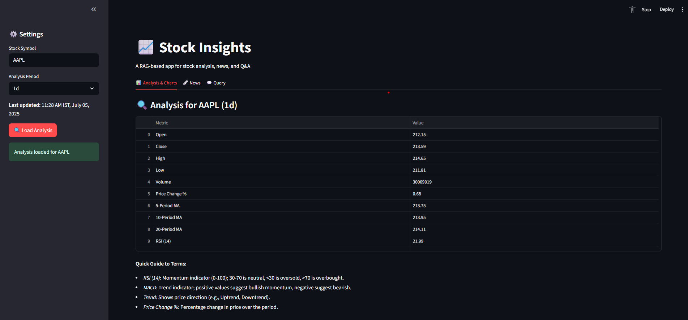
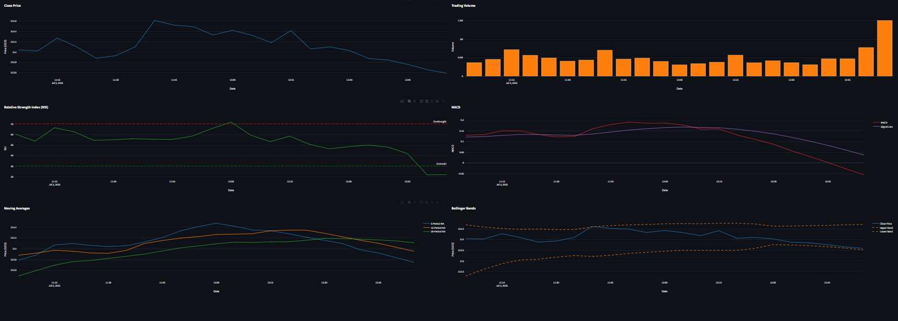
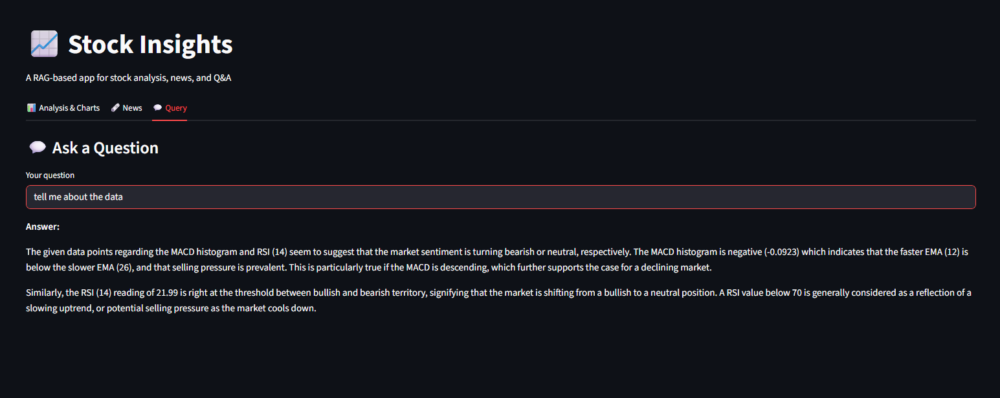

# 📊 Stock Insights – Simplified Stock Market Analysis for Beginners

**Stock Insights** is a beginner-friendly, AI-powered web application designed to simplify stock market analysis. It provides technical analysis, visualizations, news sentiment, and intelligent answers to stock-related questions – all wrapped in a clean, easy-to-use interface.

Whether you're new to trading or just want to understand your favorite stock better, this app brings together the **power of AI, interactive charts**, and **market data** in one place.

---

## 🔍 Features

- ✅ **Technical Analysis**: RSI, MACD, Moving Averages, Bollinger Bands, Trend Detection  
- 📈 **Interactive Charts**: Price, Volume, RSI, MACD, Bollinger Bands, MA lines  
- 🗞️ **News Sentiment**: Fetches recent articles with source, date & sentiment  
- 💬 **Ask Questions**: Ask anything about the stock (RAG-powered Q&A)  
- 📥 **Upload CSVs**: Analyze your own stock data from CSV  
- 🧠 **RAG with Embeddings**: Uses ChromaDB and Sentence Transformers  
- ⚙️ Built with **Streamlit** + **FastAPI**

---

## ⚙️ Installation

> Make sure you have **Python 3.9+** and **Git** installed.

```bash
# 1. Clone the repository
git clone https://github.com/your-username/stock-insights.git
cd stock-insights

# 2. Create virtual environment
python -m venv env
source env/bin/activate  # On Windows: env\Scripts\activate

# 3. Install dependencies
pip install -r requirements.txt

# 4. Configure environment variables
cp .env.example .env

# Inside .env, add:
# COHERE_API_KEY=your_api_key
# NEWS_API_URL=http://localhost:8000/fetch_stock_news
# FASTAPI_URL=http://localhost:8000/analyze_stock
```

---

## 🚀 How to Use

### 🧠 Start the Backend (FastAPI)

```bash
uvicorn main:app --reload
```

### 🌐 Launch the Frontend (Streamlit)

```bash
streamlit run rag_stock_analysis.py
```

### ✅ Example Workflow

1. Enter a stock symbol like `AAPL`, `TSLA`, or `MSFT`  
2. Click **🔍 Load Analysis**  
3. View charts, news, and smart metrics  
4. Ask questions like:  
   - “Is this stock overbought?”  
   - “What’s the MACD trend?”  

---

## 🧪 Example Queries

- “Is Microsoft in an uptrend?”
- “Compare AAPL, GOOGL, and TSLA”
- “Is this a good time to buy TSLA?”

---

## 📦 Packages Used

| Package                 | Purpose                                      |
|-------------------------|----------------------------------------------|
| `streamlit`             | Interactive web UI                           |
| `yfinance`              | Fetch stock data from Yahoo Finance          |
| `plotly`                | Charting (RSI, MACD, MA, Bollinger Bands)    |
| `pandas` / `numpy`      | Data handling and calculations               |
| `sentence-transformers` | Embedding text for RAG                       |
| `chromadb`              | Vector DB for retrieving relevant chunks     |
| `cohere`                | LLM-based natural language response          |
| `dotenv`                | Environment variable management              |
| `fastapi`               | API backend for analysis                     |
| `tenacity`              | Retry logic for external API calls           |

---

## 🖼️ Screenshots

> Add these in a folder named `assets/` and link them here:

```markdown




```

---

## 🛡️ Disclaimer

> This tool is for **educational and informational purposes only**.  
> It does **not provide financial advice**.  
> Always do your own research and consult a professional before making financial decisions.

---

## 👨‍💻 Author

**Atharsh K.**  
Passionate about making finance easier to understand through data and AI.

---